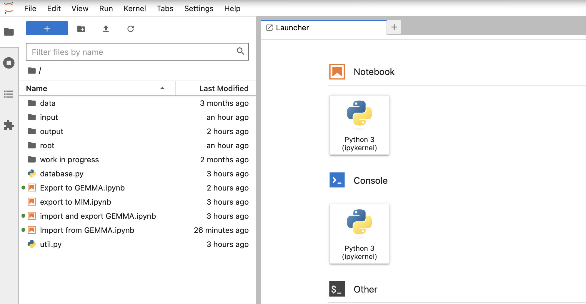

# Tooling voor het manipuleren van het GGM

Dit package bevat tooling voor het manipuleren van de database van het GGM. Hiermee kunnen bijvoorbeeld uitwisselingen met derde partijen worden vormgegeven, wordt de migratie naar MIM bewerkstelligd of kan worden ingezet om JSON-LD of databaseschema's te genereren. De tooling maakt gebruik van het feit dat het GGM is vastgelegd in Enterprise Architect van Sparx en dat deze de repository van het GGM in [Sqllite](https://www.sqlite.org/index.html) wordt bijgehouden. Uit deze SQLlite-database kan de data worden gelezen en gemanipuleerd. Ook kan de SQLlite-database worden aangepast.  

De gebruikte tooling is gebaseerd op [Jupyter Notebooks](https://jupyter.org) en [Python](https://www.python.org).

## Aan de slag

Zorg dat je [Docker](https://www.docker.com) en [Docker-compose](https://github.com/docker/compose) hebt geïnstalleerd. Dit project is voortgebouwd op [Docker Jupyter Minimal Notebook](https://github.com/jupyter/docker-stacks). Om te kunnen werken met de Jupoyter notebooks moet je de hele repository van het Gemeentelijk Gegevensmodel hebben gedownload. De notebooks bevragen direct de [EA 16-versie](https://github.com/Gemeente-Delft/Gemeentelijk-Gegevensmodel/v2.1.0/blob/master/v2.1.0/gemeentelijk%20gegevensmodel%20EA16.qea) van het Gemeentelijk Gegevensmodel. 

### Start de container

Ga vanuit de root directory van je download van het Gemeentetelijk Gegevensmodel naar de subdirectory 'tools'. Start de jupyter container met het commando 'docker compose up'. 

```sh
$ docker-compose up
```

### Toegang tot de notebooks

Je kunt nu bij de jupyter notebooks via [http://localhost:8888/](http://localhost:8888/). De directories "input" en "output" uit de tools-directory zijn nu ook binnen de container gekloppeld en zichtbaar bij de notebooks.



### Notebooks gebruiken

Binnen de huidige toolset zijn de volgende notebooks beschikbaar:

1. [Import from Gemma](http://localhost:8888/lab/workspaces/auto-1/tree/Import%20from%20GEMMA.ipynb). Maakt onderdeel uit van de uitwisseling van entiteiten met de GEMMA. Bedoeld om exports uit de GEMMA te importeren;
2.  [Export to Gemma](http://localhost:8888/lab/workspaces/auto-1/tree/Export%20to%20GEMMA.ipynb). Maakt onderdeel uit van de uitwisseling van entiteiten met de GEMMA. Bedoeld om exports te maken die in GEMMA geïmporteerd kunnen worden;
3. [Export to MIM](http://localhost:8888/lab/workspaces/auto-1/tree/Export%20to%20MIM.ipynb). **Work in progress!** Bedoeld voor de omzetting van het GGM naar MIM.
